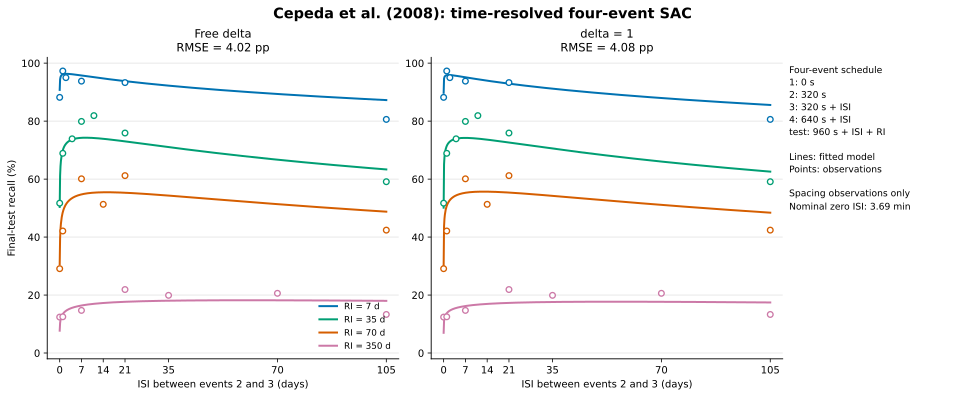

# Time-resolved SAC fits to Cepeda et al. (2008)

## Scope

These are post-hoc fits to the 26 final spacing-test observations. The newly available Session-2 forgetting observations are deliberately excluded. The nominal zero-day ISI is represented as the reported approximately 3-minute interval, $0.00256$ days.

## Four-event schedule and model

The timing approximation uses $h=320/86400=0.0037037$ days and

| Point | Absolute time |
|---|---:|
| Event 1 (Session 1) | $0$ |
| Event 2 (Session 1) | $h$ |
| Event 3 (Session 2) | $h+\mathrm{ISI}$ |
| Event 4 (Session 2) | $2h+\mathrm{ISI}$ |
| Final test | $3h+\mathrm{ISI}+\mathrm{RI}$ |

Thus the manipulated RI is the variable part of the post-event-4 delay; the supplied absolute-time schedule also places a fixed 320 seconds between event 4 and the RI anchor.

At every event, the implementation evaluates the general SAC recursion directly:

$$
u_n=\delta[1-B(t_n)],
\qquad
B(t)=\sum_{k:t_k<t}u_k f(t-t_k),
$$

with

$$
f(t)=\left(1+\frac{t}{\tau}\right)^{-d}.
$$

Latent strength is mapped to recall probability with the same logistic rule as the preceding two-event analysis:

$$
P(\mathrm{recall})=\frac{1}{1+\exp[-(B-\theta)/\sigma]}.
$$

The free-$\delta$ variant estimates $\{\delta,d,\tau,\theta,\sigma\}$; the fixed variant sets $\delta=1$ and estimates $\{d,\tau,\theta,\sigma\}$. The optimization is performed in $\log\tau$ with no lower or upper bound on that coordinate.

## Results

The two-event baseline was refit with the same code and unconstrained $\log\tau$, so the change due to the event schedule is not confounded with the earlier optimizer bounds.

| Event representation | Learning-rate variant | Parameters | $\delta$ | $d$ | $\tau$ (days) | $\theta$ | $\sigma$ | RMSE |
|---|---|---:|---:|---:|---:|---:|---:|---:|
| Two-event baseline | Free delta | 5 | 0.40129 | 0.13667 | 0.03180 | 0.24653 | 0.02668 | 4.02 pp |
| Two-event baseline | delta = 1 | 4 | 1.00000 | 0.07529 | 8.798e-11 | 0.23095 | 0.01395 | 4.13 pp |
| Four-event timing model | Free delta | 5 | 0.23061 | 0.13676 | 0.02779 | 0.24648 | 0.02669 | 4.02 pp |
| Four-event timing model | delta = 1 | 4 | 1.00000 | 0.09142 | 2.089e-11 | 0.23537 | 0.01721 | 4.08 pp |

### Change produced by the four-event schedule

| Learning-rate variant | Two-event RMSE | Four-event RMSE | Change |
|---|---:|---:|---:|
| Free delta | 4.02 pp | 4.02 pp | -0.00 pp |
| delta = 1 | 4.13 pp | 4.08 pp | -0.05 pp |

With free $\delta$, the four-event timing model is substantively indistinguishable from the two-event abstraction: RMSE improves by only 0.0001 percentage points, and the largest change among the 26 fitted predictions is 0.0033 percentage points. The extra repetitions are absorbed mainly by a change in the learning-rate estimate, from $\delta=0.4013$ to $\delta=0.2306$.

With $\delta=1$, four events improve RMSE by 0.05 percentage points and change the fitted observations by at most 0.70 percentage points. Within the four-event representation, freeing $\delta$ improves RMSE by only 0.06 percentage points. The additional learning-rate parameter therefore has little effect on spacing-only fit quality.

The free four-event fit estimates $\tau=0.02779$ days (about 40.0 minutes). By contrast, the $\delta=1$ estimate is $\tau=2.089e-11$ days, effectively zero on the experimental time scale. This is an asymptotic, weakly identified scale rather than evidence for a meaningful microsecond forgetting constant; over every positive observed lag, the shifted power law is behaving like its unshifted power-law limit. The large Jacobian condition number in the fit table is consistent with that interpretation.

The fitted optima below are constrained to the observed ISI range from the corrected zero gap through 105 days.

| Four-event variant | RI = 7 d | RI = 35 d | RI = 70 d | RI = 350 d |
|---|---:|---:|---:|---:|
| Free delta | 2.11 d | 8.34 d | 15.07 d | 59.93 d |
| delta = 1 | 1.62 d | 6.87 d | 12.83 d | 54.79 d |

Point predictions are in [`sac_cepeda2008_four_event_predictions.csv`](sac_cepeda2008_four_event_predictions.csv), and full-precision parameters and diagnostics are in [`sac_cepeda2008_four_event_fits.csv`](sac_cepeda2008_four_event_fits.csv).
