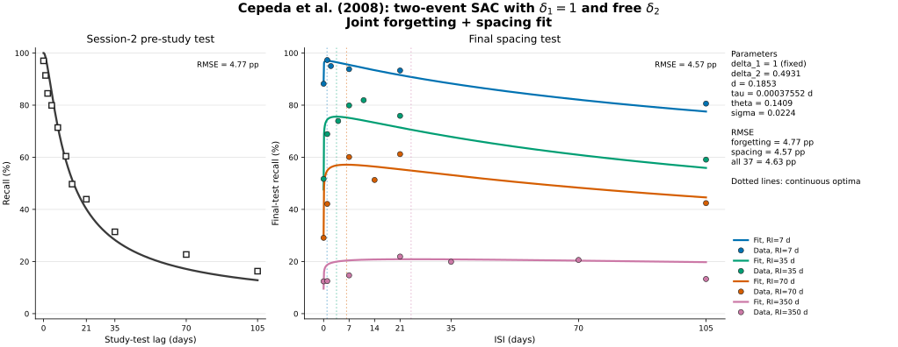
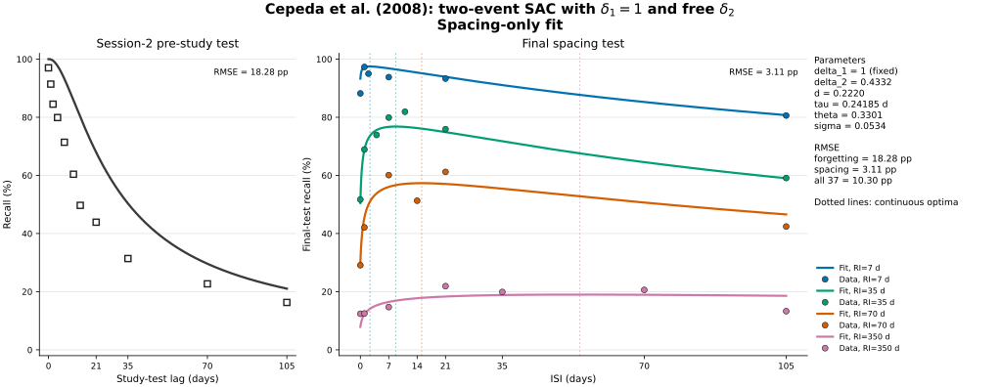

# Two-event SAC fits to Cepeda et al. (2008)

## Model

This analysis returns to the original abstraction of one study event per session. The first-session increment is fixed at one, while the second-session learning rate is estimated and acts on the unlearned proportion at the current strength:

$$
u_1=1,\qquad B(a)=f(a),\qquad u_2=\delta_2[1-B(a)].
$$

Consequently, the strengths underlying the forgetting and spacing observations are

$$
B_F(a)=f(a),
$$

$$
B_S(a,b)=f(a+b)+\delta_2[1-f(a)]f(b),
$$

where $a$ is the ISI, $b$ is the RI, and $f(t)=(1+t/\tau)^{-d}$. A shared logistic response function maps strength to recall probability:

$$
p(B)=\operatorname{logistic}\!\left(\frac{B-\theta}{\sigma}\right).
$$

The update itself is $u_2=\delta_2[1-B(a)]$; its contribution at the final test is then multiplied by $f(b)$. The pre-update interval $a$ does not decay a trace that is only created at Session 2.

The nominal zero-day condition is represented as the reported approximately 3-minute interval, $0.00256$ days. All residuals are unweighted point-level recall-probability residuals; no trial denominators or standard errors are available.

## Fit targets

Two requested fits are reported:

- **Joint:** estimates $\{\delta_2,d,\tau,\theta,\sigma\}$ from all 11 forgetting and 26 spacing observations.
- **Spacing only:** estimates the same five parameters from the 26 spacing observations; the forgetting curve is an out-of-sample diagnostic.

A forgetting-only fit cannot estimate $\delta_2$, because every forgetting observation is the Session-2 pre-study test and therefore occurs before the update governed by $\delta_2$. A purported forgetting-only prediction with a freely estimated second-session learning rate would be unidentified; it would require fixing or calibrating $\delta_2$ from some spacing data.

## Results

| Fit target | Parameters | $\delta_2$ | $d$ | $\tau$ (days) | $\theta$ | $\sigma$ | Forgetting RMSE | Spacing RMSE |
|---|---:|---:|---:|---:|---:|---:|---:|---:|
| Joint forgetting + spacing fit | 5 | 0.49308 | 0.18529 | 0.00038 | 0.14088 | 0.02242 | 4.77 pp | 4.57 pp |
| Spacing-only fit | 5 | 0.43316 | 0.22203 | 0.24185 | 0.33012 | 0.05340 | 18.28 pp | 3.11 pp |

The joint fit is the direct test of whether one parameterization can reconcile the single-study forgetting function with the four spacing curves. The spacing-only fit shows the best descriptive fit available to this session-specific-learning version and reveals what it sacrifices on the forgetting curve.

For comparison, the preceding two-event spacing-only model used one common $\delta$ at both studies and obtained 4.02 pp spacing RMSE. Fixing the first increment to one and estimating only $\delta_2$ changes that value to 3.11 pp.

## Why the spacing optimum is preserved

With one common learning rate at both sessions, the earlier two-event strength was

$$
B_{\mathrm{old}}(a,b)=\delta\{f(a+b)+f(b)-\delta f(a)f(b)\}.
$$

The leading $\delta$ is a global multiplicative scale. Under the fitted logistic response mapping it is absorbed exactly by replacing $\theta$ and $\sigma$ with $\theta/\delta$ and $\sigma/\delta$. The consequential old strength is therefore

$$
\widetilde B_{\mathrm{old}}(a,b)=f(a+b)+f(b)-\delta f(a)f(b).
$$

The present session-specific model instead gives

$$
B_{\mathrm{new}}(a,b)=f(a+b)+\delta f(b)-\delta f(a)f(b).
$$

For fixed $b$, the change is the $a$-independent offset $(\delta-1)f(b)$. Both models therefore have exactly the same derivative with respect to the ISI:

$$
\frac{dB}{da}=\left.\frac{df(t)}{dt}\right|_{t=a+b}-\delta\left.\frac{df(t)}{dt}\right|_{t=a}f(b),
$$

and therefore the same optimum condition. What changes is the tail level: as $a\to\infty$, the old normalized strength approaches $f(b)$ whereas the new strength approaches $\delta f(b)$. The second session supplies less asymptotic strength without moving the raw-strength optimum. Because the offset depends on $b$, a response mapping shared across RI conditions cannot absorb it globally.

## Interpretation

The session-specific learning rates improve the descriptive spacing-only fit by 0.91 percentage points relative to the preceding common-$\delta$ two-event fit. They do not reconcile the two datasets: imposing the forgetting observations raises spacing RMSE from 3.11 to 4.57 pp, while the spacing-only solution misses the forgetting curve by 18.28 pp.

The estimated time scale also changes sharply with the target. The joint fit places $\tau$ at 0.00038 days (about 0.5 minutes), below the shortest modeled lag of about 3.7 minutes. The spacing-only fit places it at 0.24185 days (about 5.8 hours). Thus fixing the first increment exposes, rather than removes, the tension between the forgetting curve and the spacing surface.

## Continuous optimal ISIs

For this model, an interior optimum satisfies

$$
a^*=\frac{b}{[\delta_2 f(b)]^{-1/(d+1)}-1}-\tau,
$$

with negative values replaced by the boundary $a^*=0$.

| Fit target | RI = 7 d | RI = 35 d | RI = 70 d | RI = 350 d |
|---|---:|---:|---:|---:|
| Joint forgetting + spacing fit | 0.94 d | 3.55 d | 6.30 d | 24.03 d |
| Spacing-only fit | 2.37 d | 8.73 d | 15.12 d | 54.10 d |

## Diagnostic figures

### Joint fit



### Spacing-only fit



Point predictions are in [`sac_cepeda2008_two_event_predictions.csv`](sac_cepeda2008_two_event_predictions.csv), and full-precision parameters and diagnostics are in [`sac_cepeda2008_two_event_fits.csv`](sac_cepeda2008_two_event_fits.csv).

## Reproduction

```bash
python3 src/fit_sac_cepeda2008_two_event.py
```
