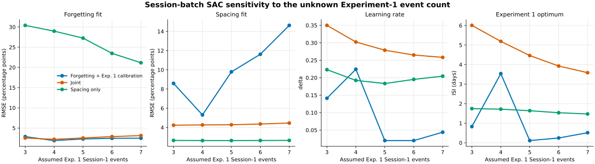
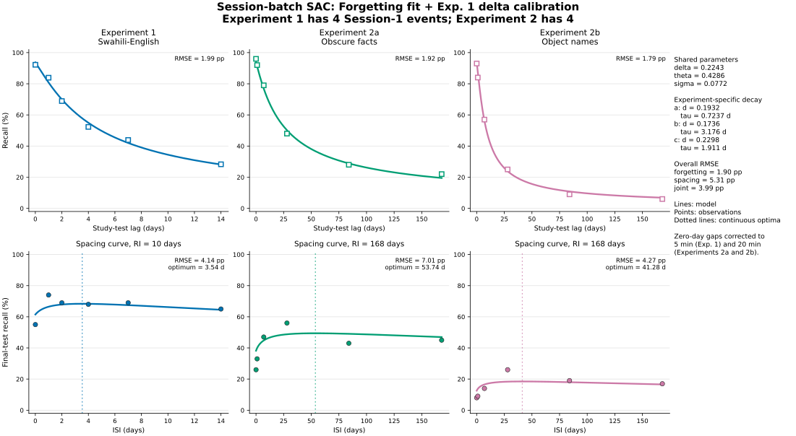
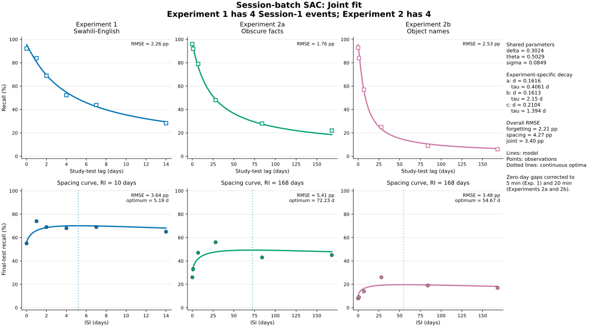
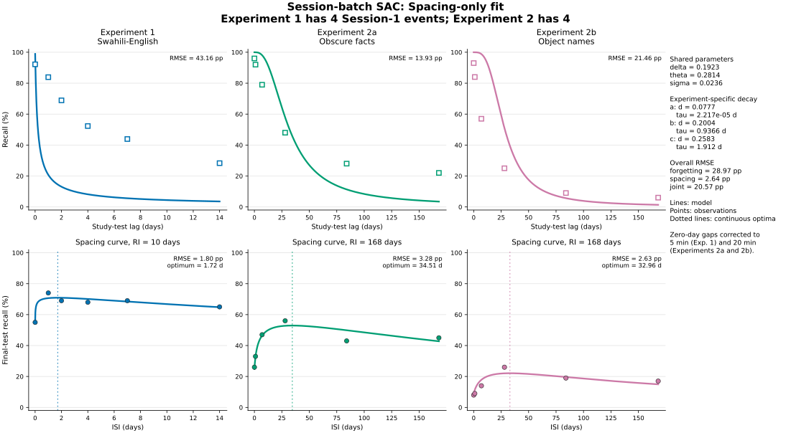

# Session-batch SAC fits to Cepeda et al. (2009)

## Model and approximation

All learning events within a session are collapsed to the same time, but their nonlinear SAC updates are retained. For a session containing $m$ events,

$$
A_m = 1-(1-\delta)^m.
$$

The forgetting and spacing strengths are

$$
B_F(a)=A_{m_1}f(a),
$$

$$
B_S(a,b)=A_{m_1}f(a+b)+A_{m_2}[1-A_{m_1}f(a)]f(b),
$$

with $f(t)=(1+t/\tau)^{-d}$ and a shared logistic response mapping. Experiment 2 uses $m_1=4$ and all experiments use $m_2=2$. Because the number of Session-1 trials in Experiment 1 is unavailable, $m_1=3,\ldots,7$ is treated as a sensitivity analysis. The nominal zero-day gaps are represented as 5 minutes in Experiment 1 and 20 minutes in Experiment 2.

Separate $d$ and $\tau$ parameters are estimated for the three curves; $\delta$, $\theta$, and $\sigma$ are shared.

The forgetting-trained protocol uses a bilevel fit: for each candidate $\delta$, all remaining parameters are optimized using only the forgetting observations; $\delta$ is then calibrated using only the Experiment-1 spacing curve. The joint and spacing-only protocols estimate every parameter from their named datasets.

## Central sensitivity assumption: Experiment 1 $m_1=4$

| Protocol | Exp. 1 $m_1$ | $\delta$ | Forgetting RMSE | Spacing RMSE | Exp. 1 optimum |
|---|---:|---:|---:|---:|---:|
| Forgetting fit + Exp. 1 delta calibration | 4 | 0.2243 | 1.90 pp | 5.31 pp | 3.54 d |
| Joint fit | 4 | 0.3024 | 2.21 pp | 4.27 pp | 5.19 d |
| Spacing-only fit | 4 | 0.1923 | 28.97 pp | 2.64 pp | 1.72 d |

## Change from the single-event approximation

The table compares the central $m_1=4$ batch model with the preceding single-event/normalized-interaction analyses. Parameter counts are unchanged within each protocol.

| Protocol | Spacing RMSE, single event | Spacing RMSE, batch | Exp. 1 optimum, single event | Exp. 1 optimum, batch |
|---|---:|---:|---:|---:|
| Forgetting fit + Exp. 1 calibration | 7.93 pp | 5.31 pp | 12.55 d | 3.54 d |
| Joint fit | 4.72 pp | 4.27 pp | 6.53 d | 5.19 d |
| Spacing-only fit | 2.61 pp | 2.64 pp | 1.53 d | 1.72 d |

The repeated-event correction therefore removes most of the extreme optimum displacement in the forgetting-trained analysis and improves the joint fit moderately. It does not fully reconcile the forgetting and spacing constraints: the spacing-only fit still prefers an Experiment-1 optimum near 1.7 days, whereas the joint fit prefers about 5.2 days. The spacing-only Experiment-1 time scale also remains at the numerical lower bound, so its excellent spacing fit does not supply a stable estimate of the underlying forgetting time scale.

## Complete sensitivity results

| Protocol | Exp. 1 $m_1$ | $\delta$ | Forgetting RMSE | Spacing RMSE | Joint RMSE | Exp. 1 optimum |
|---|---:|---:|---:|---:|---:|---:|
| Forgetting fit + Exp. 1 delta calibration | 3 | 0.1412 | 2.88 pp | 8.59 pp | 6.40 pp | 0.83 d |
| Forgetting fit + Exp. 1 delta calibration | 4 | 0.2243 | 1.90 pp | 5.31 pp | 3.99 pp | 3.54 d |
| Forgetting fit + Exp. 1 delta calibration | 5 | 0.0200 | 2.30 pp | 9.79 pp | 7.11 pp | 0.11 d |
| Forgetting fit + Exp. 1 delta calibration | 6 | 0.0200 | 2.47 pp | 11.62 pp | 8.40 pp | 0.25 d |
| Forgetting fit + Exp. 1 delta calibration | 7 | 0.0439 | 2.49 pp | 14.62 pp | 10.49 pp | 0.52 d |
| Joint fit | 3 | 0.3499 | 2.53 pp | 4.24 pp | 3.49 pp | 6.00 d |
| Joint fit | 4 | 0.3024 | 2.21 pp | 4.27 pp | 3.40 pp | 5.19 d |
| Joint fit | 5 | 0.2788 | 2.54 pp | 4.28 pp | 3.52 pp | 4.46 d |
| Joint fit | 6 | 0.2650 | 2.88 pp | 4.36 pp | 3.70 pp | 3.92 d |
| Joint fit | 7 | 0.2583 | 3.14 pp | 4.46 pp | 3.86 pp | 3.59 d |
| Spacing-only fit | 3 | 0.2231 | 30.40 pp | 2.65 pp | 21.58 pp | 1.75 d |
| Spacing-only fit | 4 | 0.1923 | 28.97 pp | 2.64 pp | 20.57 pp | 1.72 d |
| Spacing-only fit | 5 | 0.1834 | 27.25 pp | 2.64 pp | 19.36 pp | 1.64 d |
| Spacing-only fit | 6 | 0.1952 | 23.47 pp | 2.65 pp | 16.70 pp | 1.54 d |
| Spacing-only fit | 7 | 0.2045 | 21.15 pp | 2.66 pp | 15.07 pp | 1.47 d |

## Full fits for the central $m_1=4$ assumption

### Forgetting fit + Exp. 1 delta calibration

### Joint fit

### Spacing-only fit

