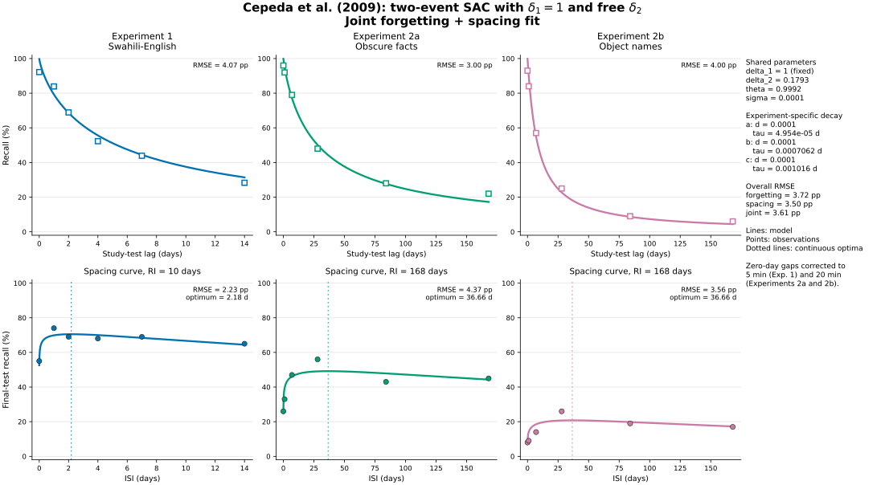
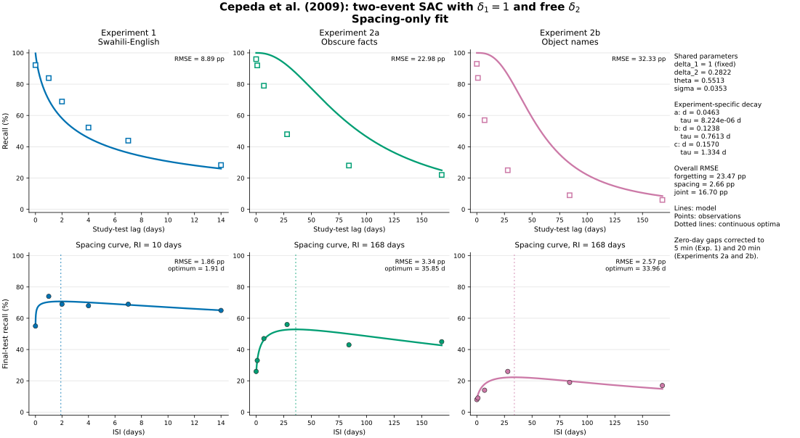

# Two-event SAC fits to Cepeda et al. (2009)

## Scope

This analysis returns to the original abstraction of one study event per experimental session. It is separate from the repeated-event batch approximation introduced in commit [`f9ba476`](https://github.com/popov-lab/optimal-spacing-memory/commit/f9ba47655903d6ad73c2a5cb8dc178987c9b464c). The first-session increment is fixed at one and the second-session learning rate is estimated:

$$
u_1=1,\qquad B_j(a)=f_j(a),\qquad u_2=\delta_2[1-B_j(a)].
$$

The forgetting and spacing strengths for experiment $j$ are

$$
B_{F,j}(a)=f_j(a),
$$

$$
B_{S,j}(a,b_j)=f_j(a+b_j)+\delta_2[1-f_j(a)]f_j(b_j),
$$

with $f_j(t)=(1+t/\tau_j)^{-d_j}$. The three experiments have separate $d_j$ and $\tau_j$; $\delta_2$ and the logistic response parameters $\theta$ and $\sigma$ are shared. The nominal zero-day conditions are represented as 5 minutes in Experiment 1 and 20 minutes in Experiments 2a and 2b.

## Why the optimum equation does not change

With a common learning rate at both sessions, the earlier raw strength was

$$
B_{\mathrm{old}}(a,b)=\delta\{f(a+b)+f(b)-\delta f(a)f(b)\}.
$$

The leading $\delta$ is absorbed exactly into the fitted logistic threshold and scale. After removing it, the consequential old and new strengths are

$$
\widetilde B_{\mathrm{old}}(a,b)=f(a+b)+f(b)-\delta f(a)f(b),
$$

$$
B_{\mathrm{new}}(a,b)=f(a+b)+\delta f(b)-\delta f(a)f(b).
$$

Their difference, $(\delta-1)f(b)$, is constant in $a$. Their derivative with respect to the ISI is therefore identical:

$$
\frac{dB}{da}=\left.\frac{df(t)}{dt}\right|_{t=a+b}-\delta\left.\frac{df(t)}{dt}\right|_{t=a}f(b).
$$

The raw-strength optimum is unchanged. The long-ISI asymptote, however, falls from $f(b)$ to $\delta f(b)$. The second session supplies less relative strength in the tails, and the shared nonlinear response mapping can convert that lower baseline into more observed forgetting without sacrificing the optimum location.

## Fit targets

- **Joint:** estimates the nine parameters from all 18 forgetting and 18 spacing observations.
- **Spacing only:** estimates the same parameters from the 18 spacing observations; the forgetting functions are out-of-sample diagnostics.

A forgetting-only fit cannot identify $\delta_2$, because the forgetting observations precede the second-session study update.

## Overall results

| Fit target | $\delta_2$ | $\theta$ | $\sigma$ | Forgetting RMSE | Spacing RMSE | Joint RMSE |
|---|---:|---:|---:|---:|---:|---:|
| Joint forgetting + spacing fit | 0.17928 | 0.99920 | 0.00009 | 3.72 pp | 3.50 pp | 3.61 pp |
| Spacing-only fit | 0.28217 | 0.55132 | 0.03533 | 23.47 pp | 2.66 pp | 16.70 pp |

## Experiment-specific results

| Fit target | Experiment | $d$ | $\tau$ (days) | Forgetting RMSE | Spacing RMSE | Model optimum | Published quadratic optimum |
|---|---|---:|---:|---:|---:|---:|---:|
| Joint forgetting + spacing fit | Experiment 1 / Swahili-English | 0.00007 | 4.954e-05 | 4.07 pp | 2.23 pp | 2.18 d | 3.7 d |
| Joint forgetting + spacing fit | Experiment 2a / Obscure facts | 0.00008 | 0.00071 | 3.00 pp | 4.37 pp | 36.66 d | 25.6 d |
| Joint forgetting + spacing fit | Experiment 2b / Object names | 0.00009 | 0.00102 | 4.00 pp | 3.56 pp | 36.66 d | 37.1 d |
| Spacing-only fit | Experiment 1 / Swahili-English | 0.04633 | 8.224e-06 | 8.89 pp | 1.86 pp | 1.91 d | 3.7 d |
| Spacing-only fit | Experiment 2a / Obscure facts | 0.12380 | 0.76130 | 22.98 pp | 3.34 pp | 35.85 d | 25.6 d |
| Spacing-only fit | Experiment 2b / Object names | 0.15705 | 1.33405 | 32.33 pp | 2.57 pp | 33.96 d | 37.1 d |

## Comparison with the preceding analyses

The central repeated-event batch analysis at $m_1=4$ reported 4.27 pp spacing RMSE for its joint fit and 2.64 pp for its spacing-only fit. The earlier common-$\delta$ single-event analysis, retained only as comparison values in the batch report, gave 4.72 and 2.61 pp respectively.

The present session-specific two-event model gives 3.50 pp jointly and 2.66 pp for spacing only. Its forgetting costs are 3.72 and 23.47 pp. The comparison therefore separates the benefit of lowering the Session-2 asymptote from the distinct consequences of modeling repeated within-session events.

## Interpretation

For the joint objective, lowering only the Session-2 asymptote reduces spacing RMSE from the recorded common-$\delta$ single-event value of 4.72 pp and the central batch value of 4.27 pp to 3.50 pp. The tradeoff is a worse forgetting fit than the batch model (3.72 versus 2.21 pp), so overall joint RMSE is 3.61 pp here versus 3.40 pp for the batch model. The spacing-only solutions are essentially tied at 2.61--2.66 pp across all three representations.

The optimum locations improve markedly relative to the central batch fit. The present joint model gives 2.18, 36.66, and 36.66 days, compared with the quadratic-fit estimates reported by Cepeda et al. of 3.7, 25.6, and 37.1 days. The central batch fit gave 5.19, 72.23, and 54.67 days. The asymptote correction therefore improves the peaks for Experiments 2a and 2b in exactly the direction suggested by the overly flat old tails.

The joint parameterization lies on a weakly identified small-$d$/small-$\sigma$ ridge: $\sigma=8.57e-05$, the three $d$ values are of order $10^{-4}$, and the Jacobian condition number is 3.88e+08. Lower-bound sensitivity changes spacing RMSE by less than 0.004 pp and leaves $\delta_2$ and the optima effectively unchanged, but the primitive decay exponents and response scale should not be interpreted separately. The stable scientific quantities are the fitted curves, the asymptotes, $\delta_2$, and the optimum locations.

## Diagnostic figures

### Joint fit



### Spacing-only fit



Point predictions are in [`sac_cepeda2009_two_event_predictions.csv`](sac_cepeda2009_two_event_predictions.csv), and full-precision parameters and diagnostics are in [`sac_cepeda2009_two_event_fits.csv`](sac_cepeda2009_two_event_fits.csv).

## Reproduction

```bash
python3 src/fit_sac_cepeda2009_two_event.py
```
