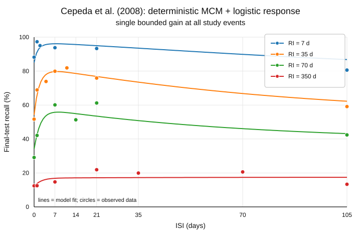
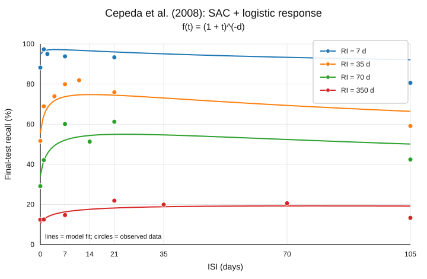
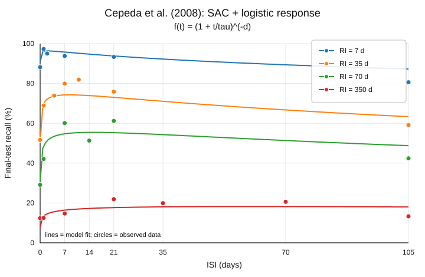

# Relationship Between SAC and the Multiscale Context Model (MCM)

## The central relationship

The two models are much closer than their surface notation suggests:

> **SAC’s shifted-power forgetting rule is exactly a continuous mixture of exponential time scales, like the representation used by MCM. The major difference is learning: SAC uses one global strength-dependent learning signal, whereas MCM computes a different error signal at each temporal scale.**

Thus, they share a broad architecture—

$$
\text{multiscale forgetting}
+
\text{state-dependent relearning},
$$

—but instantiate the second term differently.

SAC says that each presentation creates an increment determined by current total strength, and every increment subsequently follows the same shifted-power forgetting function.

MCM represents memory explicitly as a weighted collection of exponentially decaying components, then updates component $i$ according to the residual error $1-s_i$ computed from a subset of those components.

---

## 1. At the level of forgetting, they are the same kind of model

SAC uses

$$
f(t)=(1+t)^{-d}.
$$

But this is exactly a continuous mixture of exponentials:

$$
\begin{aligned}
f(t)
&=
(1+t)^{-d}
\\
&=
\frac{1}{\Gamma(d)}
\int_0^\infty
\lambda^{d-1}e^{-\lambda}e^{-\lambda t}
\,d\lambda.
\end{aligned}
$$

Equivalently,

$$
f(t)=\mathbb E_{\Lambda}\left[e^{-\Lambda t}\right],
\qquad
\Lambda\sim\operatorname{Gamma}(d,\text{rate}=1).
$$

Each value of $\lambda$ corresponds to an exponential component with time constant

$$
\tau=\frac{1}{\lambda}.
$$

So SAC’s power-law trace can be understood as an **infinite population of exponential traces with different decay rates**. In terms of time constants, the mixing distribution is inverse-gamma:

$$
p(\tau)
=
\frac{1}{\Gamma(d)}
\tau^{-d-1}e^{-1/\tau}.
$$

MCM uses the finite approximation

$$
F_N(t)=\sum_{i=1}^N\gamma_i e^{-t/\tau_i},
$$

with geometrically spaced time constants and weights.

Its representation is therefore a discrete, finite multiscale version of the same mathematical idea.

### Approximate parameter correspondence

MCM sets

$$
\tau_i=\mu\nu^i,
\qquad
\gamma_i\propto\xi^i.
$$

Because

$$
\xi^i
=
\left(\frac{\tau_i}{\mu}\right)^{\log\xi/\log\nu},
$$

define

$$
d_{\mathrm{eff}}
=
-\frac{\log\xi}{\log\nu}.
$$

Then

$$
\gamma_i\propto\tau_i^{-d_{\mathrm{eff}}}.
$$

The components are equally spaced in $\log\tau$, so the corresponding continuous density over $\tau$ is approximately

$$
p(\tau)\propto\tau^{-d_{\mathrm{eff}}-1}.
$$

Integrating exponential decay against this density gives, over the range covered by the finite bank of time scales,

$$
F_N(t)\approx Ct^{-d_{\mathrm{eff}}}.
$$

Thus a useful approximate translation is

$$
\boxed{
d_{\mathrm{SAC}}
\approx
-\frac{\log\xi}{\log\nu}
}
$$

away from the short- and long-time boundaries imposed by MCM’s finite range of scales.

So, at the level of a single-study forgetting curve, there may be essentially no substantive distinction: MCM resolves the power law into latent exponential components, while SAC writes the resulting aggregate kernel directly.

---

## 2. The cleanest common state-space formulation

Let $z_i(t)$ denote the memory state at time scale $i$, let

$$
D(t)
=
\operatorname{diag}
\left(
e^{-t/\tau_1},
\ldots,
e^{-t/\tau_N}
\right),
$$

and let

$$
\boldsymbol{\gamma}
=
(\gamma_1,\ldots,\gamma_N)^\top.
$$

Between presentations,

$$
\mathbf z(t+\Delta)
=
D(\Delta)\mathbf z(t),
$$

and total memory strength is

$$
M(t)
=
\boldsymbol{\gamma}^{\top}\mathbf z(t).
$$

Define the aggregate forgetting function

$$
F(t)
=
\boldsymbol{\gamma}^{\top}D(t)\mathbf 1
=
\sum_i\gamma_i e^{-t/\tau_i}.
$$

Both models can be placed inside this representation.

### SAC update

At a study event, SAC adds the same increment to every latent time scale:

$$
\boxed{
\mathbf z^+
=
\mathbf z^-
+
\delta
\left(
1-\boldsymbol{\gamma}^{\top}\mathbf z^-
\right)
\mathbf 1
}
$$

The learning signal is the single scalar

$$
1-M(t)=1-\boldsymbol{\gamma}^{\top}\mathbf z.
$$

This reproduces SAC exactly:

$$
u_n=\delta(1-B(t_n)),
$$

because every exponential component receives amplitude $u_n$, and averaging their subsequent decay gives $u_nf(t-t_n)$.

### MCM update

Define

$$
\Gamma_i=\sum_{j=1}^i\gamma_j
$$

and

$$
s_i
=
\frac{1}{\Gamma_i}
\sum_{j=1}^i\gamma_jz_j.
$$

MCM updates component $i$ according to

$$
\boxed{
z_i^+
=
z_i^-
+
\epsilon(1-s_i)
}
$$

rather than according to total strength $s_N$.

In matrix form, define the lower-triangular averaging operator $C$ by

$$
(C\mathbf z)_i
=
\frac{1}{\Gamma_i}
\sum_{j=1}^i\gamma_jz_j.
$$

Then

$$
\boxed{
\mathbf z^+
=
\mathbf z^-
+
\epsilon
\left(
\mathbf 1-C\mathbf z^-
\right).
}
$$

This makes the relationship especially clear:

$$
\begin{array}{ccl}
\text{SAC} &:&
C=\mathbf 1\boldsymbol{\gamma}^{\top},
\\[4pt]
\text{MCM} &:&
C=\text{lower-triangular cumulative averaging}.
\end{array}
$$

SAC asks every temporal scale the same question:

$$
\text{“How strong is the memory overall?”}
$$

MCM asks scale $i$:

$$
\text{“How strong is the memory across scales no slower than }i\text{?”}
$$

A concise characterization is therefore:

> **SAC is a global-error learning rule over a multiscale representation; MCM is a nested, scale-specific error rule over a multiscale representation.**

If MCM’s $s_i$ were replaced by $s_N$ for every $i$, its deterministic learning rule would reduce to SAC’s, apart from the particular choice of discrete versus continuous mixture.

For $N=1$, the distinction disappears completely: $s_1=s_N$, and both reduce to a scalar state-dependent learning model with exponential forgetting.

---

## 3. Direct comparison for two study events

Use $a$ for the interstudy interval and $b$ for the retention interval.

SAC gives

$$
B_{\mathrm{SAC}}(a,b)
=
\delta F(b)
+
\delta F(a+b)
-
\delta^2F(a)F(b).
$$

The terms are:

$$
\underbrace{\delta F(a+b)}_{\text{first-study trace}}
+
\underbrace{\delta F(b)}_{\text{maximum second-study trace}}
-
\underbrace{\delta^2F(a)F(b)}_{\text{learning suppressed by current total strength}}.
$$

### Corresponding deterministic MCM expression

For a clean comparison, temporarily suppose:

- both presentations are successfully encoded;
- both use the same fixed gain $\delta$;
- MCM’s retrieval-dependent switch in $\epsilon$ is ignored.

Define the partial forgetting functions

$$
F_i(a)
=
\frac{1}{\Gamma_i}
\sum_{j=1}^i
\gamma_j e^{-a/\tau_j}.
$$

Immediately before the second study, $s_i=\delta F_i(a)$. The resulting test strength is

$$
\boxed{
B_{\mathrm{MCM}}(a,b)
=
\delta F(a+b)
+
\delta F(b)
-
\delta^2
\sum_{i=1}^N
\gamma_i e^{-b/\tau_i}F_i(a).
}
$$

The first two terms are identical to SAC. The entire difference lies in the final, redundancy term:

$$
\begin{aligned}
R_{\mathrm{SAC}}(a,b)
&=
F(a)F(b),
\\[4pt]
R_{\mathrm{MCM}}(a,b)
&=
\sum_i
\gamma_i e^{-b/\tau_i}F_i(a).
\end{aligned}
$$

SAC assumes that second-study learning at every scale is suppressed by the same global value $F(a)$.

MCM suppresses learning at scale $i$ by $F_i(a)$, which depends on the profile of memory across faster and comparable scales.

Because the exponential survival values satisfy

$$
e^{-a/\tau_1}
\leq
e^{-a/\tau_2}
\leq\cdots\leq
e^{-a/\tau_N},
$$

the partial mean obeys

$$
F_i(a)\leq F(a).
$$

Consequently, in this matched deterministic comparison,

$$
\begin{aligned}
B_{\mathrm{MCM}}(a,b)-B_{\mathrm{SAC}}(a,b)
&=
\delta^2
\sum_i
\gamma_i e^{-b/\tau_i}
\left[
F(a)-F_i(a)
\right]
\\
&\geq 0.
\end{aligned}
$$

So the scale-specific MCM rule produces at least as much final strength as the corresponding global-error rule, pointwise in $a$ and $b$.

This comparison does **not** automatically establish an ordering of their optimal ISIs, and it applies only to the aligned deterministic cores, not to MCM’s retrieval-contingent and stochastic machinery.

---

## 4. The shared source of spacing: failure of the exponential semigroup

A single exponential obeys

$$
F(a+b)=F(a)F(b).
$$

Substituting this into SAC gives

$$
\begin{aligned}
B_{\mathrm{SAC}}(a,b)
&=
\delta F(b)
+
\delta F(a)F(b)
-
\delta^2F(a)F(b)
\\
&=
\delta F(b)
\left[
1+(1-\delta)F(a)
\right].
\end{aligned}
$$

For $\delta<1$, this decreases with $a$; for $\delta=1$, it is constant in $a$. Thus:

$$
\boxed{
\text{A single exponential plus SAC’s learning rule cannot produce an interior spacing optimum.}
}
$$

The multiscale mixture breaks that exact cancellation.

Let the exponential rate $\Lambda$ be random, so that

$$
F(t)=\mathbb E[e^{-\Lambda t}].
$$

Then

$$
\begin{aligned}
F(a+b)-F(a)F(b)
&=
\mathbb E
\left[
e^{-\Lambda a}e^{-\Lambda b}
\right]
-
\mathbb E[e^{-\Lambda a}]
\mathbb E[e^{-\Lambda b}]
\\
&=
\operatorname{Cov}
\left(
e^{-\Lambda a},
e^{-\Lambda b}
\right)
\\
&\geq 0.
\end{aligned}
$$

The covariance is positive because components that survive the first interval unusually well are precisely the slow components that will also survive the retention interval unusually well.

For $\delta=1$, SAC can therefore be written as

$$
\boxed{
B_{\mathrm{SAC}}(a,b)
=
F(b)
+
\operatorname{Cov}
\left(
e^{-\Lambda a},
e^{-\Lambda b}
\right).
}
$$

This is a particularly revealing decomposition:

- $F(b)$ is what the second study would contribute by itself;
- the covariance is the spacing gain caused by heterogeneity of time scales;
- it is zero for massed practice, zero asymptotically as $a\rightarrow\infty$, and positive at intermediate lags for a nondegenerate mixture.

For $\delta<1$,

$$
\begin{aligned}
B_{\mathrm{SAC}}(a,b)
={}&
\delta F(b)
+
\delta
\operatorname{Cov}
\left(
e^{-\Lambda a},
e^{-\Lambda b}
\right)
\\
&+
\delta(1-\delta)F(a)F(b).
\end{aligned}
$$

The last term decreases with spacing and favors short lags. The optimum is therefore determined by competition between:

$$
\underbrace{\text{multiscale covariance gain}}_{\text{favors intermediate spacing}}
\qquad\text{and}\qquad
\underbrace{\text{survival of incompletely learned material}}_{\text{favors short spacing}}.
$$

That clarifies why, for shifted-power forgetting, SAC has a positive interior optimum only when

$$
b>\frac{1}{\delta}-1,
$$

and why for large $b$,

$$
a^*
\sim
(\delta b)^{1/(d+1)}.
$$

---

## 5. MCM expresses the same multiscale gain more locally

With unit learning gain, the deterministic MCM expression can be rearranged as

$$
\begin{aligned}
B_{\mathrm{MCM}}(a,b)
=
F(b)
+
\sum_i
\gamma_i e^{-b/\tau_i}
\left[
e^{-a/\tau_i}
-
F_i(a)
\right].
\end{aligned}
$$

For every $i$,

$$
e^{-a/\tau_i}\geq F_i(a),
$$

because $e^{-a/\tau_i}$ is the slowest and therefore largest surviving component included in the average $F_i(a)$.

Hence each individual term is nonnegative:

$$
e^{-a/\tau_i}-F_i(a)\geq0.
$$

This is the algebraic form of MCM’s verbal mechanism:

$$
\text{decay of faster components}
\rightarrow
\text{lower }s_i
\rightarrow
\text{larger update at scale }i
\rightarrow
\text{better later retention}.
$$

The distinction is subtle but important:

- **SAC:** the spacing gain is an aggregate covariance across latent rates.
- **MCM:** the spacing gain is decomposed into explicit scale-by-scale error corrections.

MCM therefore provides a more resolved mechanistic account of something that is already implicit in SAC’s nonexponential forgetting kernel.

---

## 6. What is—and is not—a parameter correspondence

| SAC | Closest MCM analogue | Qualification |
|---|---|---|
| $f(t)$ | $\sum_i\gamma_i e^{-t/\tau_i}$ | Exact continuous-mixture versus finite discrete mixture |
| $d$ | approximately $-\log\xi/\log\nu$ | Valid over MCM’s intermediate power-law range |
| $\delta$ | learning gain $\epsilon$ | Only in a simplified deterministic comparison |
| $B(t)$ | total strength $s_N$ | Same type of weighted readout |
| $1-B(t)$ | $1-s_i$ | Global error versus scale-specific errors |
| one increment per event | updates to all $x_i$ | SAC gives all latent scales the same increment |
| none in the stripped equation | encoding probability $\omega$ | No direct deterministic equivalence |
| fixed $\delta$ | $\epsilon=1$ or $\epsilon_r>1$ | MCM gain depends on retrieval success |

MCM explicitly changes $\epsilon$ depending on whether retrieval before study succeeds, using $\epsilon_r>1$ following successful recall.

It also treats $\omega$ as a stochastic encoding probability, requiring predictions to marginalize over encoding and retrieval histories because later updates depend on the realized state.

Therefore it would generally be incorrect to identify

$$
\delta=\omega
$$

or even

$$
\delta=\omega\epsilon.
$$

That might approximate a one-step expected update, but it does not preserve the nonlinear repeated-study dynamics.

Also, the SAC document deliberately strips the larger 2020 architecture down to the equation responsible for the spacing behavior. So some of the apparent asymmetry comes from comparing a reduced SAC mechanism with a more complete MCM specification.

---

## 7. The strongest empirical distinction

Suppose two study histories produce the same current total strength:

$$
B_A(t)=B_B(t),
$$

but different distributions of strength across temporal scales.

SAC predicts the same new increment in both cases:

$$
u_A=u_B=\delta(1-B).
$$

MCM need not, because the histories can have different values of

$$
s_{i,A}\neq s_{i,B}
$$

even though

$$
s_{N,A}=s_{N,B}.
$$

It will then produce different scale-specific updates:

$$
\Delta z_{i,A}
=
\epsilon(1-s_{i,A}),
\qquad
\Delta z_{i,B}
=
\epsilon(1-s_{i,B}).
$$

This suggests a discriminating design: create learning histories matched on current total recall or strength but differing in temporal-scale composition, restudy them, and estimate the retention function of the **new learning attributable to restudy**.

SAC predicts identical restudy amplitude; MCM predicts different retention profiles.

A second distinction is conditional retrieval: MCM explicitly predicts different learning following successful versus unsuccessful retrieval, whereas the stripped SAC equation responds only to continuous current strength.

---

## Bottom line

The models relate at three different levels:

1. **Forgetting representation:**  
   SAC’s shifted power law is exactly an infinite mixture of exponentials. At this level, SAC and MCM use the same mathematical idea.

2. **Deterministic learning rule:**  
   SAC is the global-error restriction of a multiscale model:

   $$
   \Delta z_i=\delta(1-B)
   \quad\text{for every }i.
   $$

   MCM instead uses nested scale-specific errors:

   $$
   \Delta z_i=\epsilon(1-s_i).
   $$

3. **Full model:**  
   MCM additionally contains retrieval-dependent learning rates, stochastic encoding, and explicit predictions conditional on retrieval histories. It is therefore not simply SAC rewritten as exponentials.

The most theoretically consequential conclusion is that **MCM’s scale-specific cascade is not necessary for retention-interval-dependent optimal spacing**. SAC shows that a multiscale, nonexponential forgetting kernel combined with a single global familiarity-dependent learning rule already suffices. MCM adds a more detailed claim about how the temporal-scale profile of memory controls relearning.

---

# Simulations: Cepeda et al. (2008)

## Goal

The theoretical comparison above isolates the deterministic cores of SAC and MCM. One important difference from the full published MCM is that MCM maps total strength directly onto recall probability, whereas SAC ordinarily treats memory strength as a latent variable and passes it through a response rule. The simulations here ask how the two deterministic learning architectures compare when both are given the same logistic response mapping.

The analysis is restricted to the 26 recall observations from Cepeda et al. (2008), spanning retention intervals (RIs) of 7, 35, 70, and 350 days. These are post-hoc fits to the spacing data, not parameter-free predictions.

All three models use the same response mapping,

$$
P(\mathrm{recall})
=
\frac{1}{1+\exp[-(S-\theta)/\sigma]},
$$

where $S$ is latent memory strength, $\theta$ is a response threshold, and $\sigma$ controls response noise. Because this mapping is monotonic, it can magnify or compress differences in latent strength but cannot change the ordering of ISIs or create an optimum that is absent from the latent-strength function.

The nominal zero-day gap in Cepeda et al. (2008) was treated as the reported approximately 3-minute interval, $0.00256$ days.

## Deterministic MCM with a single bounded gain

For MCM, we use $N=100$ exponentially decaying components,

$$
\tau_i=\mu\nu^i,
\qquad
\gamma_i=\frac{\xi^i}{\sum_j \xi^j},
$$

with partial strength

$$
s_i
=
\frac{1}{\Gamma_i}
\sum_{j=1}^i \gamma_jx_j,
\qquad
\Gamma_i=\sum_{j=1}^i\gamma_j.
$$

At every study event, including the first, the same bounded delta-rule gain is used:

$$
\boxed{
\Delta x_i=\delta(1-s_i),
\qquad 0<\delta\le 1.
}
$$

Thus this model removes MCM's stochastic encoding histories and its retrieval-dependent switch between $\epsilon=1$ and $\epsilon_r>1$. Total latent strength at test is

$$
S_{\mathrm{MCM}}
=
\sum_i\gamma_i x_i.
$$

The free parameters are

$$
\{\mu,\nu,\xi,\delta,\theta,\sigma\}.
$$

The joint fit to all 26 observations gives

$$
\mu=0.0626,
\quad
\nu=33.5414,
\quad
\xi=0.2236,
\quad
\delta=0.7166,
$$

and response parameters

$$
\theta=0.1347,
\qquad
\sigma=0.0467.
$$

The RMSE is

$$
\boxed{3.52\text{ percentage points}.}
$$

## SAC with the original fixed time scale

For two study events separated by ISI $a$ and followed by RI $b$, SAC gives latent strength

$$
B(a,b)
=
\delta f(b)
+
\delta f(a+b)
-
\delta^2 f(a)f(b).
$$

We first retain the forgetting function used in the stripped SAC formulation,

$$
f(t)=(1+t)^{-d}.
$$

The free parameters are therefore

$$
\{\delta,d,\theta,\sigma\}.
$$

The joint fit gives

$$
\delta=0.6139,
\qquad
d=0.2894,
$$

with

$$
\theta=0.2875,
\qquad
\sigma=0.0616.
$$

The RMSE is

$$
\boxed{4.98\text{ percentage points}.}
$$

## SAC with an explicit forgetting time scale

The original SAC forgetting rule fixes the temporal scale implicitly by measuring $t$ in the units for which the additive constant is 1. We therefore also fit the generalized shifted-power function

$$
\boxed{
f(t)
=
\left(1+\frac{t}{\tau}\right)^{-d}.
}
$$

This adds one time-scale parameter, giving

$$
\{\delta,d,\tau,\theta,\sigma\}.
$$

The joint fit gives

$$
\delta=0.4013,
\qquad
d=0.1367,
\qquad
\tau=0.0318\text{ days},
$$

where $\tau\approx46$ minutes, together with

$$
\theta=0.2465,
\qquad
\sigma=0.0267.
$$

The RMSE falls to

$$
\boxed{4.02\text{ percentage points}.}
$$

## Comparison

| Model | Free parameters | RMSE (percentage points) |
|---|---:|---:|
| Deterministic MCM + logistic response | 6 | **3.52** |
| SAC + logistic response, $f(t)=(1+t)^{-d}$ | 4 | 4.98 |
| SAC + logistic response, $f(t)=(1+t/\tau)^{-d}$ | 5 | **4.02** |

Three points stand out.

First, a conventional bounded learning rate is sufficient for the deterministic MCM core once latent strength is separated from response probability. The fit does not require the very large retrieval-contingent gain $\epsilon_r>1$ used in the full published MCM.

Second, SAC already captures the major spacing pattern with only four parameters when the original fixed-scale forgetting rule is combined with the same logistic response mapping. Adding an explicit time-scale parameter improves the fit by almost one percentage point of RMSE and substantially closes the gap to MCM.

Third, the raw RMSE comparison should not be treated as a formal model-selection result. The MCM fit has six free parameters, SAC with $\tau$ has five, and fixed-scale SAC has four. All parameters in this section were fit directly to the same 26 spacing observations. The purpose of the comparison is narrower: to determine whether the different latent learning architectures can generate the observed spacing geometry when the mapping from latent strength to recall probability is treated consistently across models.

The resulting comparison supports a cleaner theoretical interpretation than a direct strength-to-probability fit. Both models can produce the RI-dependent spacing pattern in latent strength. A threshold-and-noise response layer then maps relatively modest latent-strength differences onto the much larger differences observed in recall probability.
